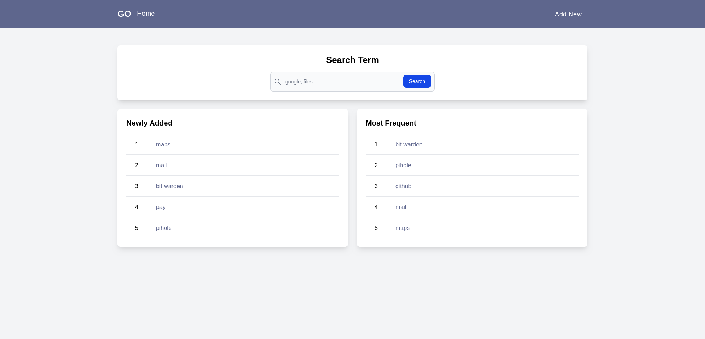
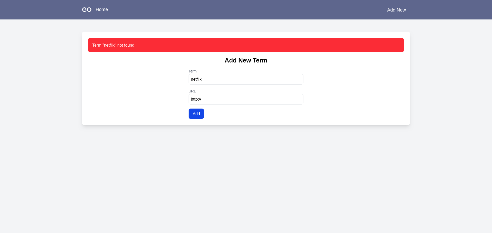
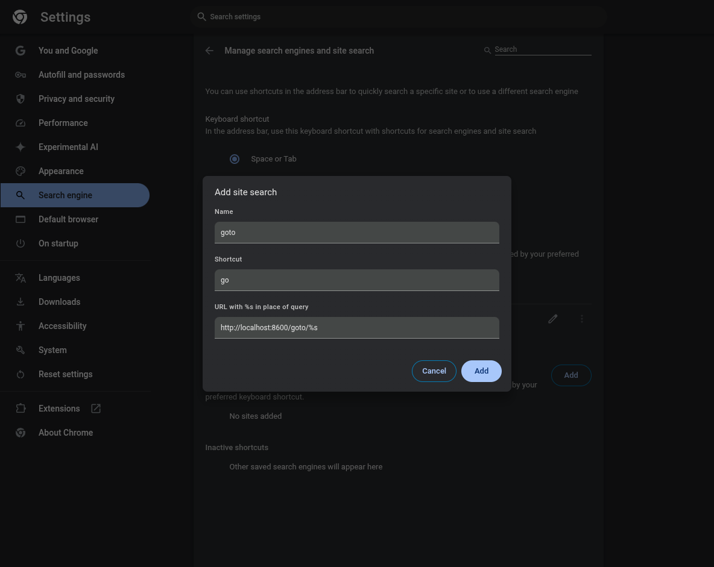
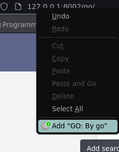
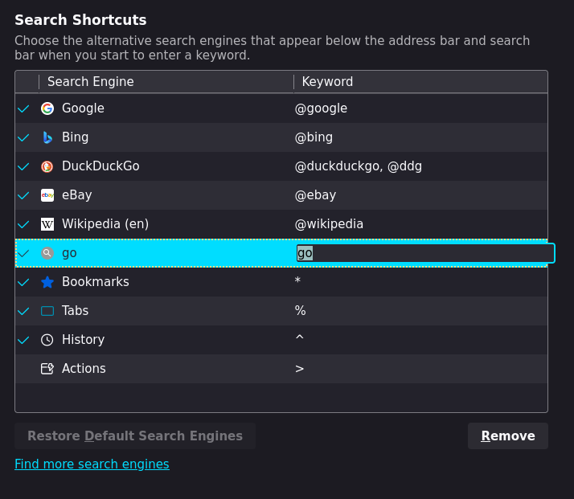

# GoTo link

A simple, fast and easy tool for manage shortcuts to your favourite websites.

## What is it?

A simple go to alias link manager. Simply add as a search engine in Chrome or Firefox and create shortcuts to websites.

To go to a website, simply type `goto <alias>` in the address bar.






## How to use

### Add to Chrome

1. Go to `chrome://settings/searchEngines`
2. Add a new search engine with the following values:
   - Search engine: `GoTo`
   - Keyword: `go`
   - URL: `http://localhost:8600/goto/%s`



### Add to Firefox

1. Navigate to the go home page: `localhost:8600`
2. Right-click on the address bar and select `Add GO: by go`



3. Then go to `about:preferences#search`
4. Add a keyword for the search engine



### Docker

#### IF YOU WANT TO CHANGE THE PORT THEN IT NEEDS TO BE UPDATED IN `static/go.xml` TO ALLOW THE SEARCH ENGINE TO WORK

```xml
<?xml version="1.0" encoding="UTF-8"?>
<OpenSearchDescription xmlns="http://a9.com/-/spec/opensearch/1.1/">
	<ShortName>go</ShortName>
	<Description>GO Search quick</Description>
	<Url type="text/html" template="http://0.0.0.0:8600/go/{searchTerms}" />
</OpenSearchDescription>
```

```bash
docker build -t goto .
docker run -d -p 8600:5000 --name goto --restart always goto 
```

### Docker compose

```yaml
services:
  goto:
    build: .
    restart: always
    ports:
      - "8600:5000"
# uncomment the following lines to add a redis container
#    environment:
#      - DB_TYPE=redis
#      - DB_PATH=redis://redis:6379/0
#    depends_on:
#      - redis
#  redis:
#    image: "redis:latest"
#    ports:
#      - "6379:6379"
```

### Manual

```bash
pip install -r requirements.txt
python app.py
```

### Environment variables

- `DB_TYPE`: 
  - `'sqlite'` For an SQLite database
  - `'redis'` For a Redis database
  - `'json'` For a JSON file
- `DB_PATH`: 
  - `terms.db` For an SQLite database
  - `terms.json` For a JSON file
  - `redis://<redis-host>:6379/0` For a Redis database
- `FLASK_HOST`: The host to run the Flask app on
- `FLASK_PORT`: The port to run the Flask app on