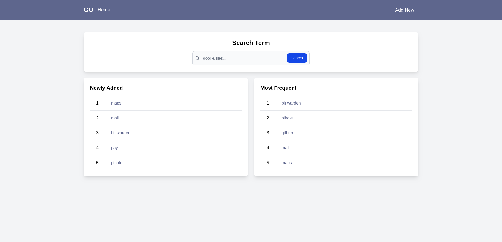
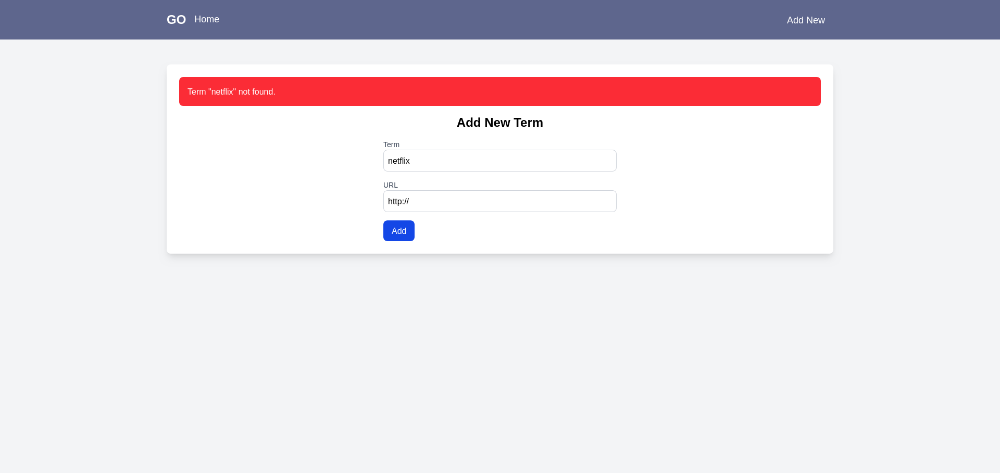

# GoTo link

A simple, fast and easy tool for manage shortcuts to your favourite websites.

## What is it?

A simple go to alias link manager. Simply add as a search engine in Chrome or Firefox and create shortcuts to websites.

To go to a website, simply type `goto <alias>` in the address bar.






## How to use

### Docker

```bash
docker build -t goto .
docker run -d -p 8080:5000 --name goto --restart always goto 
```